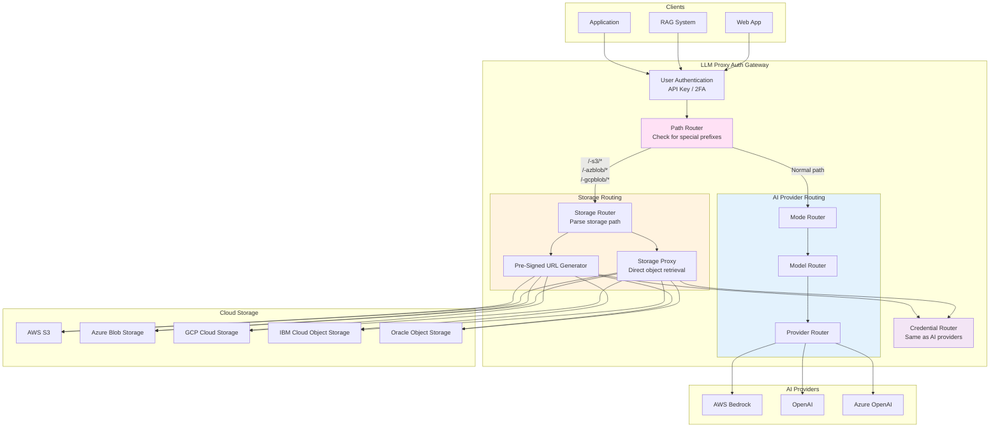

# Storage Routing and Pre-Signed URL Generation

This document describes the storage routing layer that enables authenticated access to cloud object storage (S3, Azure Blob, GCP Storage) with automatic credential embedding and pre-signed URL generation.

---

## Overview

The gateway can route requests to **cloud storage services** in addition to AI providers, using special path prefixes:

```
/-https/<route>/<path>    → Generic HTTPS resources with auth
/-s3/<route>/<path>       → AWS S3 objects
/-azblob/<route>/<path>   → Azure Blob Storage
/-gcpblob/<route>/<path>  → GCP Cloud Storage
/-ibmcos/<route>/<path>   → IBM Cloud Object Storage
/-ociobj/<route>/<path>   → Oracle Cloud Object Storage

[no special prefix]       → AI Provider (default behavior)
```

**Use Cases:**
- 📄 **RAG Applications** - Retrieve documents from object storage for context
- 🖼️ **Image Processing** - Access images stored in cloud buckets
- 🔐 **Secure Access** - Generate pre-signed URLs with centralized auth
- 🔄 **Multi-Cloud Storage** - Unified API for different storage providers
- 📊 **Data Pipeline** - Access training data, datasets, models

---

## Architecture



---

## Path Format

### Storage Path Structure

```
/-<storage-type>/<route>/<operation>/<bucket-or-container>/<object-path>
```

**Components:**
- `<storage-type>`: `s3`, `azblob`, `gcpblob`, `ibmcos`, `ociobj`, `https`
- `<route>`: Instance name from configuration (e.g., `prod`, `dev`, `us-east-1`)
- `<operation>`: `get`, `presign`, `list`, `put`, `delete`
- `<bucket-or-container>`: Storage bucket/container name
- `<object-path>`: Path to object within bucket

### Examples

```bash
# Get object from S3 (proxied through gateway)
GET /-s3/prod/get/my-bucket/documents/report.pdf

# Generate pre-signed URL for S3 object
GET /-s3/prod/presign/my-bucket/documents/report.pdf?ttl=3600

# Get blob from Azure Storage
GET /-azblob/prod/get/mycontainer/images/photo.jpg

# Generate pre-signed URL for Azure Blob
GET /-azblob/prod/presign/mycontainer/images/photo.jpg?ttl=3600

# List objects in GCP bucket
GET /-gcpblob/prod/list/my-bucket/prefix/

# Generic HTTPS resource with auth injection
GET /-https/api-gateway/get/api.example.com/v1/data
```

---

## Configuration

### Storage Instances Configuration

```yaml
# configs/storage-instances.yaml

storage_instances:
  # AWS S3 Production
  s3_prod:
    type: s3
    region: us-east-1
    route_name: prod  # Matches /-s3/prod/...

    authentication:
      strategies:
        - type: workload_identity
          provider: aws
        - type: vault
          backend: hashicorp
          path: aws/sts/s3-readonly
        - type: kubernetes_secret
          secret_name: s3-credentials

    # Pre-signed URL settings
    presign:
      default_ttl: 3600  # 1 hour
      max_ttl: 86400     # 24 hours
      allowed_operations: [get, put]

    # Access control
    access:
      allowed_buckets:
        - my-data-bucket
        - public-assets
        - rag-documents
      denied_prefixes:
        - /secret/
        - /admin/

  # Azure Blob Storage Production
  azblob_prod:
    type: azblob
    account_name: mystorageaccount
    route_name: prod

    authentication:
      strategies:
        - type: workload_identity
          provider: azure
        - type: vault
          backend: azure_key_vault
          secret_name: storage-account-key

    presign:
      default_ttl: 3600
      max_ttl: 86400

    access:
      allowed_containers:
        - documents
        - images
        - models

  # GCP Cloud Storage Production
  gcpblob_prod:
    type: gcpblob
    project_id: my-gcp-project
    route_name: prod

    authentication:
      strategies:
        - type: workload_identity
          provider: gcp
        - type: vault
          backend: gcp_secret_manager
          secret_name: gcs-service-account

    presign:
      default_ttl: 3600
      method: v4  # or v2 for legacy

    access:
      allowed_buckets:
        - training-data
        - inference-models

  # Generic HTTPS with authentication injection
  https_api_gateway:
    type: https
    base_url: https://api.example.com
    route_name: api-gateway

    authentication:
      strategies:
        - type: vault
          backend: hashicorp
          path: secret/api-tokens
          key_field: api_key

      inject_as: header  # or query, basic_auth
      header_name: X-API-Key

# Default behavior when no storage prefix is detected
default_routing: ai_providers  # Route to AI providers
```

---

## Operations

### 1. Get Object (Proxied)

**Request:**
```bash
GET /-s3/prod/get/my-bucket/documents/report.pdf
X-API-Key: user-api-key
```

**Flow:**
1. User authentication with API key
2. Path router detects `/-s3/` prefix
3. Storage router parses: `route=prod`, `operation=get`, `bucket=my-bucket`, `path=documents/report.pdf`
4. Credential router gets AWS credentials (IRSA or Vault)
5. Gateway fetches object from S3 using embedded credentials
6. Returns object content to client

**Response:**
```
Content-Type: application/pdf
Content-Length: 1234567

[PDF binary data]
```

---

### 2. Generate Pre-Signed URL

**Request:**
```bash
GET /-s3/prod/presign/my-bucket/documents/report.pdf?ttl=3600
X-API-Key: user-api-key
```

**Flow:**
1. User authentication
2. Storage router detects `presign` operation
3. Credential router gets AWS credentials
4. Pre-signed URL generator creates temporary URL with embedded AWS signature
5. Returns pre-signed URL to client

**Response:**
```json
{
  "url": "https://my-bucket.s3.amazonaws.com/documents/report.pdf?X-Amz-Algorithm=AWS4-HMAC-SHA256&X-Amz-Credential=ASIA...&X-Amz-Date=20250115T120000Z&X-Amz-Expires=3600&X-Amz-Signature=...",
  "expires_at": "2025-01-15T13:00:00Z",
  "ttl": 3600,
  "bucket": "my-bucket",
  "key": "documents/report.pdf"
}
```

**Client can now use this URL directly:**
```bash
# No authentication needed - signature embedded in URL
curl "https://my-bucket.s3.amazonaws.com/documents/report.pdf?X-Amz-Algorithm=..."
```

---

### 3. List Objects

**Request:**
```bash
GET /-s3/prod/list/my-bucket/documents/?prefix=reports/&max_keys=100
X-API-Key: user-api-key
```

**Response:**
```json
{
  "bucket": "my-bucket",
  "prefix": "documents/reports/",
  "objects": [
    {
      "key": "documents/reports/2025-01-report.pdf",
      "size": 1234567,
      "last_modified": "2025-01-15T10:30:00Z",
      "etag": "\"abc123...\""
    },
    {
      "key": "documents/reports/2025-02-report.pdf",
      "size": 9876543,
      "last_modified": "2025-02-15T10:30:00Z",
      "etag": "\"def456...\""
    }
  ],
  "count": 2,
  "truncated": false
}
```

---

### 4. Put Object (Upload)

**Request:**
```bash
PUT /-s3/prod/put/my-bucket/uploads/newfile.txt
X-API-Key: user-api-key
Content-Type: text/plain

Hello, world!
```

**Response:**
```json
{
  "bucket": "my-bucket",
  "key": "uploads/newfile.txt",
  "size": 13,
  "etag": "\"5eb63bbbe01eeed093cb22bb8f5acdc3\"",
  "version_id": "null"
}
```

---

## Implementation

### Path Router

```go
// internal/router/path_router.go
package router

import (
    "strings"
    "net/http"
)

type PathRouter struct {
    storageRouter   *StorageRouter
    aiRouter        *AIRouter
}

func (r *PathRouter) Route(req *http.Request) (Handler, error) {
    path := req.URL.Path

    // Check for storage prefixes
    if strings.HasPrefix(path, "/-s3/") {
        return r.storageRouter.RouteS3(req)
    }
    if strings.HasPrefix(path, "/-azblob/") {
        return r.storageRouter.RouteAzureBlob(req)
    }
    if strings.HasPrefix(path, "/-gcpblob/") {
        return r.storageRouter.RouteGCPBlob(req)
    }
    if strings.HasPrefix(path, "/-ibmcos/") {
        return r.storageRouter.RouteIBMCOS(req)
    }
    if strings.HasPrefix(path, "/-ociobj/") {
        return r.storageRouter.RouteOCIObject(req)
    }
    if strings.HasPrefix(path, "/-https/") {
        return r.storageRouter.RouteHTTPS(req)
    }

    // Default: Route to AI providers
    return r.aiRouter.Route(req)
}
```

### Storage Path Parser

```go
// internal/storage/path_parser.go
package storage

import (
    "fmt"
    "strings"
)

type StoragePath struct {
    StorageType string // s3, azblob, gcpblob
    RouteName   string // prod, dev, us-east-1
    Operation   string // get, presign, list, put, delete
    Bucket      string // bucket or container name
    ObjectPath  string // path within bucket
}

func ParseStoragePath(path string) (*StoragePath, error) {
    // Example: /-s3/prod/get/my-bucket/documents/report.pdf

    parts := strings.Split(strings.TrimPrefix(path, "/"), "/")
    if len(parts) < 4 {
        return nil, fmt.Errorf("invalid storage path")
    }

    // parts[0] = "-s3"
    // parts[1] = "prod"
    // parts[2] = "get"
    // parts[3] = "my-bucket"
    // parts[4:] = ["documents", "report.pdf"]

    storageType := strings.TrimPrefix(parts[0], "-")

    return &StoragePath{
        StorageType: storageType,
        RouteName:   parts[1],
        Operation:   parts[2],
        Bucket:      parts[3],
        ObjectPath:  strings.Join(parts[4:], "/"),
    }, nil
}
```

### Pre-Signed URL Generator - AWS S3

```go
// internal/storage/presign/s3_presigner.go
package presign

import (
    "context"
    "time"

    "github.com/aws/aws-sdk-go-v2/service/s3"
    "github.com/aws/aws-sdk-go-v2/aws"
)

type S3Presigner struct {
    client       *s3.Client
    presignClient *s3.PresignClient
}

func NewS3Presigner(cfg aws.Config) *S3Presigner {
    client := s3.NewFromConfig(cfg)
    return &S3Presigner{
        client:        client,
        presignClient: s3.NewPresignClient(client),
    }
}

func (p *S3Presigner) GeneratePresignedGetURL(
    ctx context.Context,
    bucket string,
    key string,
    ttl time.Duration,
) (string, error) {

    request, err := p.presignClient.PresignGetObject(ctx, &s3.GetObjectInput{
        Bucket: aws.String(bucket),
        Key:    aws.String(key),
    }, func(opts *s3.PresignOptions) {
        opts.Expires = ttl
    })

    if err != nil {
        return "", err
    }

    return request.URL, nil
}

func (p *S3Presigner) GeneratePresignedPutURL(
    ctx context.Context,
    bucket string,
    key string,
    ttl time.Duration,
) (string, error) {

    request, err := p.presignClient.PresignPutObject(ctx, &s3.PutObjectInput{
        Bucket: aws.String(bucket),
        Key:    aws.String(key),
    }, func(opts *s3.PresignOptions) {
        opts.Expires = ttl
    })

    if err != nil {
        return "", err
    }

    return request.URL, nil
}
```

### Pre-Signed URL Generator - Azure Blob

```go
// internal/storage/presign/azblob_presigner.go
package presign

import (
    "context"
    "fmt"
    "time"

    "github.com/Azure/azure-sdk-for-go/sdk/storage/azblob"
    "github.com/Azure/azure-sdk-for-go/sdk/storage/azblob/sas"
)

type AzureBlobPresigner struct {
    serviceClient *azblob.Client
    credential    *azblob.SharedKeyCredential
}

func NewAzureBlobPresigner(
    accountName string,
    credential *azblob.SharedKeyCredential,
) *AzureBlobPresigner {
    serviceURL := fmt.Sprintf("https://%s.blob.core.windows.net/", accountName)
    client, _ := azblob.NewClientWithSharedKeyCredential(serviceURL, credential, nil)

    return &AzureBlobPresigner{
        serviceClient: client,
        credential:    credential,
    }
}

func (p *AzureBlobPresigner) GeneratePresignedGetURL(
    ctx context.Context,
    container string,
    blob string,
    ttl time.Duration,
) (string, error) {

    // Create SAS token
    sasURL, err := p.serviceClient.ServiceClient().
        NewContainerClient(container).
        NewBlobClient(blob).
        GetSASURL(
            sas.BlobPermissions{Read: true},
            time.Now().Add(ttl),
            &azblob.GetSASURLOptions{},
        )

    if err != nil {
        return "", err
    }

    return sasURL, nil
}
```

### Pre-Signed URL Generator - GCP Cloud Storage

```go
// internal/storage/presign/gcp_presigner.go
package presign

import (
    "context"
    "time"

    "cloud.google.com/go/storage"
)

type GCPPresigner struct {
    client *storage.Client
}

func NewGCPPresigner(ctx context.Context) (*GCPPresigner, error) {
    client, err := storage.NewClient(ctx)
    if err != nil {
        return nil, err
    }

    return &GCPPresigner{
        client: client,
    }, nil
}

func (p *GCPPresigner) GeneratePresignedGetURL(
    ctx context.Context,
    bucket string,
    object string,
    ttl time.Duration,
) (string, error) {

    opts := &storage.SignedURLOptions{
        Method:  "GET",
        Expires: time.Now().Add(ttl),
    }

    url, err := p.client.Bucket(bucket).SignedURL(object, opts)
    if err != nil {
        return "", err
    }

    return url, nil
}
```

---

## Storage Handler

```go
// internal/storage/handler.go
package storage

import (
    "context"
    "io"
    "net/http"
    "time"

    "llmproxy/internal/auth"
)

type StorageHandler struct {
    credRouter   *auth.CredentialRouter
    s3Presigner  *S3Presigner
    azPresigner  *AzureBlobPresigner
    gcpPresigner *GCPPresigner
}

func (h *StorageHandler) HandleStorageRequest(
    ctx context.Context,
    req *http.Request,
    sp *StoragePath,
) (*http.Response, error) {

    // Get credentials for this storage instance
    creds, err := h.credRouter.GetCredentials(ctx, sp.RouteName)
    if err != nil {
        return nil, err
    }

    switch sp.Operation {
    case "get":
        return h.handleGet(ctx, sp, creds)
    case "presign":
        return h.handlePresign(ctx, sp, creds, req)
    case "list":
        return h.handleList(ctx, sp, creds)
    case "put":
        return h.handlePut(ctx, sp, creds, req.Body)
    case "delete":
        return h.handleDelete(ctx, sp, creds)
    default:
        return nil, fmt.Errorf("unknown operation: %s", sp.Operation)
    }
}

func (h *StorageHandler) handlePresign(
    ctx context.Context,
    sp *StoragePath,
    creds *auth.Credentials,
    req *http.Request,
) (*http.Response, error) {

    // Parse TTL from query parameter
    ttlStr := req.URL.Query().Get("ttl")
    ttl := 3600 * time.Second // default 1 hour
    if ttlStr != "" {
        if parsed, err := time.ParseDuration(ttlStr + "s"); err == nil {
            ttl = parsed
        }
    }

    var presignedURL string
    var err error

    switch sp.StorageType {
    case "s3":
        presignedURL, err = h.s3Presigner.GeneratePresignedGetURL(
            ctx, sp.Bucket, sp.ObjectPath, ttl,
        )
    case "azblob":
        presignedURL, err = h.azPresigner.GeneratePresignedGetURL(
            ctx, sp.Bucket, sp.ObjectPath, ttl,
        )
    case "gcpblob":
        presignedURL, err = h.gcpPresigner.GeneratePresignedGetURL(
            ctx, sp.Bucket, sp.ObjectPath, ttl,
        )
    default:
        return nil, fmt.Errorf("unsupported storage type: %s", sp.StorageType)
    }

    if err != nil {
        return nil, err
    }

    // Return JSON response with pre-signed URL
    response := map[string]interface{}{
        "url":        presignedURL,
        "expires_at": time.Now().Add(ttl).Format(time.RFC3339),
        "ttl":        int(ttl.Seconds()),
        "bucket":     sp.Bucket,
        "key":        sp.ObjectPath,
    }

    return jsonResponse(http.StatusOK, response), nil
}
```

---

## Access Control

### Bucket/Container Restrictions

```yaml
# Only allow access to specific buckets
access:
  allowed_buckets:
    - public-assets
    - user-uploads
    - rag-documents

  # Deny specific prefixes
  denied_prefixes:
    - /secret/
    - /admin/
    - /.internal/

  # Require specific permissions per operation
  operations:
    get:
      allowed: true
    presign:
      allowed: true
      max_ttl: 86400
    put:
      allowed: false  # Uploads disabled
    delete:
      allowed: false  # Deletions disabled
```

### Validation

```go
func (h *StorageHandler) validateAccess(
    sp *StoragePath,
    config *StorageInstanceConfig,
) error {

    // Check bucket allowlist
    if !contains(config.Access.AllowedBuckets, sp.Bucket) {
        return fmt.Errorf("access denied: bucket %s not allowed", sp.Bucket)
    }

    // Check denied prefixes
    for _, prefix := range config.Access.DeniedPrefixes {
        if strings.HasPrefix(sp.ObjectPath, prefix) {
            return fmt.Errorf("access denied: prefix %s is restricted", prefix)
        }
    }

    // Check operation permissions
    opConfig := config.Access.Operations[sp.Operation]
    if !opConfig.Allowed {
        return fmt.Errorf("operation %s is not allowed", sp.Operation)
    }

    return nil
}
```

---

## Metrics

```go
// pkg/metrics/storage_metrics.go
var (
    StorageRequestsTotal = promauto.NewCounterVec(
        prometheus.CounterOpts{
            Name: "llmproxy_storage_requests_total",
            Help: "Total storage requests",
        },
        []string{"storage_type", "route", "operation", "status"},
    )

    StoragePresignedURLsGenerated = promauto.NewCounterVec(
        prometheus.CounterOpts{
            Name: "llmproxy_storage_presigned_urls_total",
            Help: "Total pre-signed URLs generated",
        },
        []string{"storage_type", "route"},
    )

    StorageObjectSizeBytes = promauto.NewHistogramVec(
        prometheus.HistogramOpts{
            Name: "llmproxy_storage_object_size_bytes",
            Help: "Size of objects retrieved",
            Buckets: prometheus.ExponentialBuckets(1024, 2, 15), // 1KB to 16MB
        },
        []string{"storage_type", "route"},
    )
)
```

---

## RAG Integration Example

### Use Case: Document Retrieval for RAG

```python
from openai import OpenAI

# Initialize clients
llm_client = OpenAI(
    base_url="http://llmproxy:8090/openai/bedrock_us1",
    api_key="user-api-key"
)

proxy_url = "http://llmproxy:8090"

# 1. Get document from S3 through proxy
import requests
doc_response = requests.get(
    f"{proxy_url}/-s3/prod/get/rag-documents/policies/2025-policy.pdf",
    headers={"X-API-Key": "user-api-key"}
)
document_text = extract_text_from_pdf(doc_response.content)

# 2. Use document as context for LLM
response = llm_client.chat.completions.create(
    model="claude-3-sonnet",
    messages=[
        {
            "role": "user",
            "content": f"Based on this policy document:\n\n{document_text}\n\nAnswer: What is the vacation policy?"
        }
    ]
)

print(response.choices[0].message.content)
```

### Use Case: Generate Temporary Access URLs

```python
# Generate pre-signed URL for client-side access
import requests

response = requests.get(
    f"{proxy_url}/-s3/prod/presign/rag-documents/policies/2025-policy.pdf",
    params={"ttl": 3600},  # 1 hour
    headers={"X-API-Key": "user-api-key"}
)

presigned_data = response.json()
print(f"Temporary URL (expires in 1 hour):")
print(presigned_data["url"])

# Client can now access directly without auth
# Perfect for web apps that need temporary file access
```

---

## Benefits

| Benefit | Description |
|---------|-------------|
| **Unified Auth** | Same API key for AI and storage |
| **Credential Abstraction** | Users don't need cloud credentials |
| **Multi-Cloud** | Access S3, Azure Blob, GCS with same API |
| **RAG Enablement** | Easy document retrieval for context |
| **Secure URLs** | Generate temporary access without exposing credentials |
| **Audit Trail** | All storage access logged with user identity |
| **Cost Control** | Track storage access per user |

---

## Security Considerations

1. **TTL Limits**: Enforce maximum TTL for pre-signed URLs
2. **Bucket Restrictions**: Only allow access to approved buckets
3. **Prefix Blocking**: Block sensitive paths (/secret/, /admin/)
4. **Operation Controls**: Disable put/delete if read-only access needed
5. **Rate Limiting**: Prevent abuse of pre-signed URL generation
6. **Audit Logging**: Log all storage operations with user context

---

## Next Steps

1. Implement path router with storage prefix detection
2. Add storage path parser
3. Implement pre-signed URL generators for each cloud
4. Add storage handler with get/presign/list operations
5. Configure storage instances
6. Add access control validation
7. Implement metrics and logging
8. Test RAG integration
9. Document client usage patterns

---

This extends the LLM Proxy Auth to be a **complete cloud access gateway** for both AI and storage services! 🚀
