# Workload Identity and Credential Management for All Providers

This document describes how to implement secure, auto-rotated credential management for all AI providers, similar to AWS IRSA.

---

## Overview

Instead of storing long-lived API keys in Kubernetes secrets, use native workload identity solutions where available, and Vault for providers without native support.

**Important**: The workload identity solutions available depend on **where your Kubernetes cluster is running**.

---

## Kubernetes Platform Compatibility Matrix

| AI Provider | AWS EKS | Azure AKS | Google GKE | IBM Cloud (IKS/ROKS) | Oracle OKE | Self-Managed K8s |
|-------------|---------|-----------|------------|----------------------|------------|------------------|
| **AWS Bedrock** | ✅ IRSA | ⚠️ OIDC¹ | ⚠️ OIDC¹ | ⚠️ OIDC¹ | ⚠️ OIDC¹ | ⚠️ OIDC¹ |
| **Azure OpenAI** | ⚠️ Federated² | ✅ Workload Identity | ⚠️ Federated² | ⚠️ Federated² | ⚠️ Federated² | ⚠️ Federated² |
| **Google Vertex AI** | ⚠️ Federated³ | ⚠️ Federated³ | ✅ Workload Identity | ⚠️ Federated³ | ⚠️ Federated³ | ⚠️ Federated³ |
| **IBM watsonx.ai** | 🔄 Vault | 🔄 Vault | 🔄 Vault | ✅ Compute Resource⁴ | 🔄 Vault | 🔄 Vault |
| **Oracle Cloud AI** | 🔄 Vault | 🔄 Vault | 🔄 Vault | 🔄 Vault | ✅ Resource Principal | 🔄 Vault |
| **OpenAI** | 🔄 Vault | 🔄 Vault | 🔄 Vault | 🔄 Vault | 🔄 Vault | 🔄 Vault |
| **Anthropic** | 🔄 Vault | 🔄 Vault | 🔄 Vault | 🔄 Vault | 🔄 Vault | 🔄 Vault |

**Legend:**
- ✅ **Native** - Best option, no setup required
- ⚠️ **Federated** - Requires OIDC federation setup (advanced)
- 🔄 **Vault** - Use HashiCorp Vault for dynamic secrets

**Notes:**
1. AWS IRSA from non-EKS requires [OIDC federation](https://docs.aws.amazon.com/IAM/latest/UserGuide/id_roles_providers_create_oidc.html)
2. Azure Workload Identity from non-AKS requires [federated identity](https://learn.microsoft.com/en-us/azure/active-directory/develop/workload-identity-federation)
3. GCP Workload Identity from non-GKE requires [workload identity federation](https://cloud.google.com/iam/docs/workload-identity-federation)
4. IBM Compute Resource auth requires IBM Cloud Kubernetes Service

---

## Recommended Setup by Kubernetes Platform

### Running on AWS EKS (Most Common)

```mermaid
flowchart LR
    subgraph EKS["Your AWS EKS Cluster"]
        POD[LLM Proxy Pod]
    end

    POD -->|✅ IRSA| BEDROCK[AWS Bedrock]
    POD -->|🔄 Vault| AZURE[Azure OpenAI]
    POD -->|🔄 Vault| VERTEX[Google Vertex AI]
    POD -->|🔄 Vault| OPENAI[OpenAI]
    POD -->|🔄 Vault| ANTHROPIC[Anthropic]
    POD -->|🔄 Vault| IBM[IBM watsonx]
    POD -->|🔄 Vault| ORACLE[Oracle Cloud]

    style BEDROCK fill:#e8f5e9
    style AZURE fill:#ffe6e6
    style VERTEX fill:#ffe6e6
    style OPENAI fill:#ffe6e6
    style ANTHROPIC fill:#ffe6e6
    style IBM fill:#ffe6e6
    style ORACLE fill:#ffe6e6
```



**Best Practice for EKS:**
- ✅ Use IRSA for AWS Bedrock (native, no setup)
- 🔄 Use HashiCorp Vault for all other providers
- Alternative: Cross-cloud OIDC federation (complex, not recommended)

### Running on Azure AKS

```mermaid
flowchart LR
    subgraph AKS["Your Azure AKS Cluster"]
        POD[LLM Proxy Pod]
    end

    POD -->|✅ Managed Identity| AZURE[Azure OpenAI]
    POD -->|🔄 Vault| BEDROCK[AWS Bedrock]
    POD -->|🔄 Vault| VERTEX[Google Vertex AI]
    POD -->|🔄 Vault| OPENAI[OpenAI]
    POD -->|🔄 Vault| ANTHROPIC[Anthropic]
    POD -->|🔄 Vault| IBM[IBM watsonx]
    POD -->|🔄 Vault| ORACLE[Oracle Cloud]

    style AZURE fill:#e8f5e9
    style BEDROCK fill:#ffe6e6
    style VERTEX fill:#ffe6e6
    style OPENAI fill:#ffe6e6
    style ANTHROPIC fill:#ffe6e6
    style IBM fill:#ffe6e6
    style ORACLE fill:#ffe6e6
```



**Best Practice for AKS:**
- ✅ Use Azure AD Workload Identity for Azure OpenAI
- 🔄 Use HashiCorp Vault for all other providers

### Running on Google GKE

```mermaid
flowchart LR
    subgraph GKE["Your Google GKE Cluster"]
        POD[LLM Proxy Pod]
    end

    POD -->|✅ Workload Identity| VERTEX[Google Vertex AI]
    POD -->|🔄 Vault| BEDROCK[AWS Bedrock]
    POD -->|🔄 Vault| AZURE[Azure OpenAI]
    POD -->|🔄 Vault| OPENAI[OpenAI]
    POD -->|🔄 Vault| ANTHROPIC[Anthropic]
    POD -->|🔄 Vault| IBM[IBM watsonx]
    POD -->|🔄 Vault| ORACLE[Oracle Cloud]

    style VERTEX fill:#e8f5e9
    style BEDROCK fill:#ffe6e6
    style AZURE fill:#ffe6e6
    style OPENAI fill:#ffe6e6
    style ANTHROPIC fill:#ffe6e6
    style IBM fill:#ffe6e6
    style ORACLE fill:#ffe6e6
```



**Best Practice for GKE:**
- ✅ Use GCP Workload Identity for Google Vertex AI
- 🔄 Use HashiCorp Vault for all other providers

### Running on Self-Managed Kubernetes (On-Premise/Multi-Cloud)

```mermaid
flowchart LR
    subgraph K8S["Your K8s Cluster"]
        POD[LLM Proxy Pod]
    end

    POD -->|🔄 Vault| BEDROCK[AWS Bedrock]
    POD -->|🔄 Vault| AZURE[Azure OpenAI]
    POD -->|🔄 Vault| VERTEX[Google Vertex AI]
    POD -->|🔄 Vault| OPENAI[OpenAI]
    POD -->|🔄 Vault| ANTHROPIC[Anthropic]
    POD -->|🔄 Vault| IBM[IBM watsonx]
    POD -->|🔄 Vault| ORACLE[Oracle Cloud]

    style BEDROCK fill:#ffe6e6
    style AZURE fill:#ffe6e6
    style VERTEX fill:#ffe6e6
    style OPENAI fill:#ffe6e6
    style ANTHROPIC fill:#ffe6e6
    style IBM fill:#ffe6e6
    style ORACLE fill:#ffe6e6
```



**Best Practice for Self-Managed:**
- 🔄 Use HashiCorp Vault for all providers (consistent approach)
- Alternative: External Secrets Operator + cloud secret managers

---

## Decision Tree: Which Solution to Use?

```mermaid
flowchart TD
    START[Where is your K8s cluster?]

    START -->|AWS EKS| EKS_DECISION
    START -->|Azure AKS| AKS_DECISION
    START -->|Google GKE| GKE_DECISION
    START -->|IBM Cloud IKS/ROKS| IBM_DECISION
    START -->|Oracle OKE| OKE_DECISION
    START -->|Self-Managed/Other| VAULT_ALL

    EKS_DECISION{Which provider?}
    EKS_DECISION -->|AWS Bedrock| EKS_IRSA[✅ Use AWS IRSA]
    EKS_DECISION -->|Others| VAULT_EKS[🔄 Use Vault]

    AKS_DECISION{Which provider?}
    AKS_DECISION -->|Azure OpenAI| AKS_WI[✅ Use Azure Workload Identity]
    AKS_DECISION -->|Others| VAULT_AKS[🔄 Use Vault]

    GKE_DECISION{Which provider?}
    GKE_DECISION -->|Google Vertex| GKE_WI[✅ Use GCP Workload Identity]
    GKE_DECISION -->|Others| VAULT_GKE[🔄 Use Vault]

    IBM_DECISION{Which provider?}
    IBM_DECISION -->|IBM watsonx| IBM_CR[✅ Use Compute Resource Auth]
    IBM_DECISION -->|Others| VAULT_IBM[🔄 Use Vault]

    OKE_DECISION{Which provider?}
    OKE_DECISION -->|Oracle Cloud| OKE_RP[✅ Use Resource Principal]
    OKE_DECISION -->|Others| VAULT_OKE[🔄 Use Vault]

    VAULT_ALL[🔄 Use HashiCorp Vault<br/>for all providers]

    style EKS_IRSA fill:#e8f5e9
    style AKS_WI fill:#e8f5e9
    style GKE_WI fill:#e8f5e9
    style IBM_CR fill:#e8f5e9
    style OKE_RP fill:#e8f5e9
    style VAULT_ALL fill:#fff3e0
    style VAULT_EKS fill:#fff3e0
    style VAULT_AKS fill:#fff3e0
    style VAULT_GKE fill:#fff3e0
    style VAULT_IBM fill:#fff3e0
    style VAULT_OKE fill:#fff3e0
```




---

## Provider-Specific Solutions

### 1. AWS Bedrock - IRSA (Already Implemented ✅)

**Current Implementation:**

```yaml
apiVersion: v1
kind: ServiceAccount
metadata:
  name: bedrock-proxy-sa
  namespace: bedrock-system
  annotations:
    eks.amazonaws.com/role-arn: arn:aws:iam::ACCOUNT:role/bedrock-proxy-role
```

**Benefits:**
- ✅ No credentials in pod
- ✅ Auto-rotated every hour
- ✅ Fine-grained IAM permissions
- ✅ Audit trail via CloudTrail

---

### 2. Azure OpenAI - Azure AD Workload Identity

**Setup:**

```yaml
# 1. Enable OIDC issuer on AKS
az aks update \
  --resource-group myResourceGroup \
  --name myAKSCluster \
  --enable-oidc-issuer \
  --enable-workload-identity

# 2. Create Azure Managed Identity
az identity create \
  --name llmproxy-azure-identity \
  --resource-group myResourceGroup \
  --location eastus

# 3. Assign permissions to Azure OpenAI
az role assignment create \
  --role "Cognitive Services User" \
  --assignee <MANAGED_IDENTITY_CLIENT_ID> \
  --scope /subscriptions/<SUBSCRIPTION>/resourceGroups/<RG>/providers/Microsoft.CognitiveServices/accounts/<AZURE_OPENAI_RESOURCE>
```

**Kubernetes Configuration:**

```yaml
apiVersion: v1
kind: ServiceAccount
metadata:
  name: llmproxy-sa
  namespace: llmproxy-system
  annotations:
    azure.workload.identity/client-id: <MANAGED_IDENTITY_CLIENT_ID>
    azure.workload.identity/tenant-id: <AZURE_TENANT_ID>

---
apiVersion: apps/v1
kind: Deployment
metadata:
  name: llmproxy
  namespace: llmproxy-system
spec:
  template:
    metadata:
      labels:
        azure.workload.identity/use: "true"
    spec:
      serviceAccountName: llmproxy-sa
      containers:
      - name: llmproxy
        image: llmproxy:latest
        env:
        - name: AZURE_CLIENT_ID
          value: <MANAGED_IDENTITY_CLIENT_ID>
        - name: AZURE_TENANT_ID
          value: <AZURE_TENANT_ID>
        - name: AZURE_FEDERATED_TOKEN_FILE
          value: /var/run/secrets/azure/tokens/azure-identity-token
```

**Code Changes:**

```go
// internal/auth/azure_signer.go
package auth

import (
    "github.com/Azure/azure-sdk-for-go/sdk/azidentity"
    "github.com/Azure/azure-sdk-for-go/sdk/azcore"
)

type AzureAuthenticator struct {
    credential azcore.TokenCredential
}

func NewAzureAuthenticator() (*AzureAuthenticator, error) {
    // Uses Azure Workload Identity automatically
    cred, err := azidentity.NewDefaultAzureCredential(nil)
    if err != nil {
        return nil, err
    }

    return &AzureAuthenticator{
        credential: cred,
    }, nil
}

func (a *AzureAuthenticator) GetToken(ctx context.Context) (string, error) {
    token, err := a.credential.GetToken(ctx, policy.TokenRequestOptions{
        Scopes: []string{"https://cognitiveservices.azure.com/.default"},
    })
    if err != nil {
        return "", err
    }
    return token.Token, nil
}
```

**Benefits:**
- ✅ No API keys in configuration
- ✅ Auto-rotated tokens
- ✅ Azure RBAC integration
- ✅ Works with Azure Monitor for audit

---

### 3. Google Vertex AI - GCP Workload Identity

**Setup:**

```bash
# 1. Enable Workload Identity on GKE cluster
gcloud container clusters update CLUSTER_NAME \
  --workload-pool=PROJECT_ID.svc.id.goog

# 2. Create GCP Service Account
gcloud iam service-accounts create llmproxy-vertex \
  --project=PROJECT_ID

# 3. Grant Vertex AI permissions
gcloud projects add-iam-policy-binding PROJECT_ID \
  --member "serviceAccount:llmproxy-vertex@PROJECT_ID.iam.gserviceaccount.com" \
  --role "roles/aiplatform.user"

# 4. Bind K8s SA to GCP SA
gcloud iam service-accounts add-iam-policy-binding \
  llmproxy-vertex@PROJECT_ID.iam.gserviceaccount.com \
  --role roles/iam.workloadIdentityUser \
  --member "serviceAccount:PROJECT_ID.svc.id.goog[llmproxy-system/llmproxy-sa]"
```

**Kubernetes Configuration:**

```yaml
apiVersion: v1
kind: ServiceAccount
metadata:
  name: llmproxy-sa
  namespace: llmproxy-system
  annotations:
    iam.gke.io/gcp-service-account: llmproxy-vertex@PROJECT_ID.iam.gserviceaccount.com

---
apiVersion: apps/v1
kind: Deployment
metadata:
  name: llmproxy
spec:
  template:
    spec:
      serviceAccountName: llmproxy-sa
      containers:
      - name: llmproxy
        env:
        - name: GOOGLE_APPLICATION_CREDENTIALS
          value: /var/run/secrets/workload-identity/google-application-credentials.json
```

**Code Changes:**

```go
// internal/auth/gcp_signer.go
package auth

import (
    "cloud.google.com/go/vertexai/genai"
    "google.golang.org/api/option"
)

type GCPAuthenticator struct {
    client *genai.Client
}

func NewGCPAuthenticator(ctx context.Context, projectID, location string) (*GCPAuthenticator, error) {
    // Uses Workload Identity automatically via ADC
    client, err := genai.NewClient(ctx, projectID, location, option.WithQuotaProject(projectID))
    if err != nil {
        return nil, err
    }

    return &GCPAuthenticator{
        client: client,
    }, nil
}
```

**Benefits:**
- ✅ No service account keys
- ✅ Auto-rotated credentials
- ✅ GCP IAM integration
- ✅ Audit logging via Cloud Audit Logs

---

### 4. IBM watsonx.ai - IBM Cloud IAM with Compute Resources

**Setup:**

```bash
# 1. Create IBM Cloud Service ID
ibmcloud iam service-id-create llmproxy-watsonx \
  --description "Service ID for LLM Proxy to access watsonx.ai"

# 2. Assign watsonx.ai access policy
ibmcloud iam service-policy-create llmproxy-watsonx \
  --roles Viewer,Writer \
  --service-name pm-20 \
  --service-instance WATSONX_INSTANCE_ID

# 3. Create API key for the service ID
ibmcloud iam service-api-key-create llmproxy-watsonx-key llmproxy-watsonx \
  --description "API key for LLM Proxy"

# 4. For Kubernetes integration, use IBM Secrets Manager
```

**Kubernetes Configuration with IBM Secrets Manager:**

```yaml
apiVersion: v1
kind: ServiceAccount
metadata:
  name: llmproxy-sa
  namespace: llmproxy-system

---
apiVersion: external-secrets.io/v1beta1
kind: SecretStore
metadata:
  name: ibm-secrets-manager
  namespace: llmproxy-system
spec:
  provider:
    ibm:
      serviceUrl: https://INSTANCE_ID.us-south.secrets-manager.appdomain.cloud
      auth:
        secretRef:
          secretApiKey:
            name: ibm-api-key
            key: apiKey

---
apiVersion: external-secrets.io/v1beta1
kind: ExternalSecret
metadata:
  name: watsonx-credentials
  namespace: llmproxy-system
spec:
  refreshInterval: 1h
  secretStoreRef:
    name: ibm-secrets-manager
    kind: SecretStore
  target:
    name: watsonx-api-key
  data:
  - secretKey: apiKey
    remoteRef:
      key: watsonx-api-key
```

**Benefits:**
- ✅ Service ID instead of user credentials
- ✅ Automated rotation via External Secrets Operator
- ✅ IBM Cloud IAM policies
- ✅ Audit via IBM Cloud Activity Tracker

---

### 5. Oracle Cloud AI - OCI Resource Principal

**Setup:**

```bash
# 1. Create Dynamic Group for OKE pods
oci iam dynamic-group create \
  --name llmproxy-dynamic-group \
  --description "Dynamic group for LLM Proxy pods" \
  --matching-rule "ALL {instance.compartment.id = 'ocid1.compartment...'}"

# 2. Create policy to allow access to OCI Generative AI
oci iam policy create \
  --compartment-id ocid1.compartment... \
  --name llmproxy-genai-policy \
  --description "Allow LLM Proxy to access OCI Generative AI" \
  --statements '["Allow dynamic-group llmproxy-dynamic-group to use generative-ai-family in compartment id ocid1.compartment..."]'
```

**Kubernetes Configuration:**

```yaml
apiVersion: apps/v1
kind: Deployment
metadata:
  name: llmproxy
spec:
  template:
    spec:
      containers:
      - name: llmproxy
        env:
        - name: OCI_RESOURCE_PRINCIPAL_VERSION
          value: "2.2"
        - name: OCI_RESOURCE_PRINCIPAL_REGION
          value: us-ashburn-1
```

**Code Changes:**

```go
// internal/auth/oci_signer.go
package auth

import (
    "github.com/oracle/oci-go-sdk/v65/common"
    "github.com/oracle/oci-go-sdk/v65/common/auth"
)

type OCIAuthenticator struct {
    provider common.ConfigurationProvider
}

func NewOCIAuthenticator() (*OCIAuthenticator, error) {
    // Uses Resource Principal authentication
    provider, err := auth.ResourcePrincipalConfigurationProvider()
    if err != nil {
        return nil, err
    }

    return &OCIAuthenticator{
        provider: provider,
    }, nil
}
```

**Benefits:**
- ✅ No API keys or credentials in pod
- ✅ Dynamic group-based access
- ✅ OCI IAM policies
- ✅ Audit via OCI Audit service

---

### 6. OpenAI / Anthropic - HashiCorp Vault Dynamic Secrets

For providers without native workload identity, use Vault for secure credential management.

**Setup:**

```bash
# 1. Install Vault
helm repo add hashicorp https://helm.releases.hashicorp.com
helm install vault hashicorp/vault --namespace vault

# 2. Enable Kubernetes auth
vault auth enable kubernetes

vault write auth/kubernetes/config \
  kubernetes_host="https://kubernetes.default.svc:443"

# 3. Create policy for LLM Proxy
vault policy write llmproxy - <<EOF
path "secret/data/openai/*" {
  capabilities = ["read"]
}
path "secret/data/anthropic/*" {
  capabilities = ["read"]
}
EOF

# 4. Create Kubernetes role
vault write auth/kubernetes/role/llmproxy \
  bound_service_account_names=llmproxy-sa \
  bound_service_account_namespaces=llmproxy-system \
  policies=llmproxy \
  ttl=1h
```

**Store Secrets in Vault:**

```bash
# OpenAI API Key
vault kv put secret/openai/api-key \
  key=sk-proj-...

# Anthropic API Key
vault kv put secret/anthropic/api-key \
  key=sk-ant-...
```

**Kubernetes Configuration with Vault Agent Injector:**

```yaml
apiVersion: apps/v1
kind: Deployment
metadata:
  name: llmproxy
spec:
  template:
    metadata:
      annotations:
        vault.hashicorp.com/agent-inject: "true"
        vault.hashicorp.com/role: "llmproxy"
        vault.hashicorp.com/agent-inject-secret-openai: "secret/data/openai/api-key"
        vault.hashicorp.com/agent-inject-template-openai: |
          {{- with secret "secret/data/openai/api-key" -}}
          export OPENAI_API_KEY="{{ .Data.data.key }}"
          {{- end }}
        vault.hashicorp.com/agent-inject-secret-anthropic: "secret/data/anthropic/api-key"
        vault.hashicorp.com/agent-inject-template-anthropic: |
          {{- with secret "secret/data/anthropic/api-key" -}}
          export ANTHROPIC_API_KEY="{{ .Data.data.key }}"
          {{- end }}
    spec:
      serviceAccountName: llmproxy-sa
```

**Alternative: Vault CSI Provider:**

```yaml
apiVersion: secrets-store.csi.x-k8s.io/v1
kind: SecretProviderClass
metadata:
  name: llmproxy-vault-secrets
spec:
  provider: vault
  parameters:
    vaultAddress: "http://vault.vault.svc.cluster.local:8200"
    roleName: "llmproxy"
    objects: |
      - objectName: "openai-api-key"
        secretPath: "secret/data/openai/api-key"
        secretKey: "key"
      - objectName: "anthropic-api-key"
        secretPath: "secret/data/anthropic/api-key"
        secretKey: "key"

---
apiVersion: apps/v1
kind: Deployment
metadata:
  name: llmproxy
spec:
  template:
    spec:
      serviceAccountName: llmproxy-sa
      volumes:
      - name: secrets-store
        csi:
          driver: secrets-store.csi.k8s.io
          readOnly: true
          volumeAttributes:
            secretProviderClass: "llmproxy-vault-secrets"
      containers:
      - name: llmproxy
        volumeMounts:
        - name: secrets-store
          mountPath: "/mnt/secrets-store"
          readOnly: true
```

**Benefits:**
- ✅ Centralized secret management
- ✅ Automated rotation policies
- ✅ Audit logging
- ✅ Dynamic secrets generation
- ✅ Encryption at rest and in transit

---

## Recommended Architecture


---

## Implementation Priority

### Phase 1: Native Workload Identity (Weeks 1-2)
1. ✅ AWS IRSA (already done)
2. 🔄 Azure AD Workload Identity
3. 🔄 GCP Workload Identity

### Phase 2: Vault Integration (Weeks 3-4)
1. 🔄 Deploy HashiCorp Vault
2. 🔄 Configure Kubernetes auth
3. 🔄 Migrate OpenAI/Anthropic to Vault
4. 🔄 Set up auto-rotation

### Phase 3: Additional Providers (Weeks 5-6)
1. 🔄 IBM Cloud IAM integration
2. 🔄 OCI Resource Principal
3. 🔄 External Secrets Operator

---

## Security Comparison

| Provider | Current (API Keys) | Target (Workload Identity) | Security Improvement |
|----------|-------------------|----------------------------|---------------------|
| AWS Bedrock | ✅ IRSA | ✅ IRSA | Already optimal |
| Azure OpenAI | ❌ Static API Key | ✅ Managed Identity | **High** - No keys, auto-rotation |
| Google Vertex | ❌ Service Account Key | ✅ Workload Identity | **High** - No keys, short-lived tokens |
| IBM watsonx.ai | ❌ Static API Key | ⚠️ External Secrets | **Medium** - Centralized, rotation |
| Oracle Cloud | ❌ Static API Key | ✅ Resource Principal | **High** - No keys, dynamic auth |
| OpenAI | ❌ Static API Key | ⚠️ Vault Dynamic Secrets | **Medium** - Centralized, rotation |
| Anthropic | ❌ Static API Key | ⚠️ Vault Dynamic Secrets | **Medium** - Centralized, rotation |

---

## Code Changes Required

### Update Provider Interface

```go
// internal/providers/interface.go
type Provider interface {
    // Existing methods...

    // New: Support for dynamic credential refresh
    RefreshCredentials(ctx context.Context) error

    // New: Support for workload identity
    UseWorkloadIdentity() bool
}
```

### Update Configuration

```yaml
# configs/provider-instances.yaml
instances:
  bedrock_us1_openai:
    type: bedrock
    authentication:
      type: workload_identity  # Changed from aws_sigv4
      provider: aws_irsa

  azure_us1_openai:
    type: azure
    authentication:
      type: workload_identity  # New
      provider: azure_managed_identity

  vertex_us1_openai:
    type: vertex
    authentication:
      type: workload_identity  # New
      provider: gcp_workload_identity

  openai_proxy:
    type: openai
    authentication:
      type: vault_dynamic  # New
      vault_path: secret/openai/api-key
      refresh_interval: 1h
```

---

## Monitoring & Alerts

Add metrics for credential health:

```go
// pkg/metrics/auth_metrics.go
var (
    CredentialRefreshTotal = promauto.NewCounterVec(
        prometheus.CounterOpts{
            Name: "llmproxy_credential_refresh_total",
            Help: "Total number of credential refreshes",
        },
        []string{"provider", "method", "status"},
    )

    CredentialAge = promauto.NewGaugeVec(
        prometheus.GaugeOpts{
            Name: "llmproxy_credential_age_seconds",
            Help: "Age of current credentials in seconds",
        },
        []string{"provider", "method"},
    )
)
```

---

## Next Steps

1. **Review and approve** this architecture
2. **Start with Azure Workload Identity** (easiest after IRSA)
3. **Deploy Vault** for OpenAI/Anthropic
4. **Add GCP Workload Identity** for Vertex AI
5. **Update documentation** with setup guides
6. **Add monitoring** for credential health

---

## References

- [AWS IRSA](https://docs.aws.amazon.com/eks/latest/userguide/iam-roles-for-service-accounts.html)
- [Azure Workload Identity](https://azure.github.io/azure-workload-identity/)
- [GCP Workload Identity](https://cloud.google.com/kubernetes-engine/docs/how-to/workload-identity)
- [IBM Cloud IAM](https://cloud.ibm.com/docs/account?topic=account-serviceids)
- [OCI Resource Principal](https://docs.oracle.com/en-us/iaas/Content/API/Concepts/sdk_authentication_methods.htm#sdk_authentication_methods_resource_principal)
- [HashiCorp Vault on Kubernetes](https://developer.hashicorp.com/vault/tutorials/kubernetes)
- [External Secrets Operator](https://external-secrets.io/)
